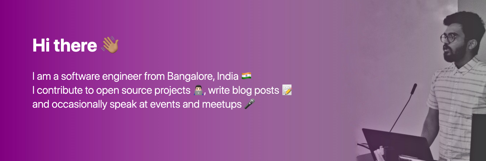

[](https://shubhamzanwar.github.io)

#### Tech I work with

```react💙``` ```vue💚``` ```js💛``` ```nodejs``` ```react native📱```

#### Currently working on

```vue-nodegui```: A VueJS port to [nodegui](https://github.com/nodegui/nodegui) 🥳

```vue3 guide```: a guide to creating production ready applications using Vue 3 📖

```flippie```: A react based cards animations library. Find it [here](https://github.com/flipspace/flippie) 🧩

#### Stuff I'm learning

```AWS ⛅️``` ```flutter 🎯```

#### React out to me 

[](https://medium.com/@zanwar.shubham) [](https://twitter.com/szanwar22) [](https://github.com/shubhamzanwar) [](https://stackoverflow.com/users/5301597/sershubham) [](mailto:zanwar.shubham@gmail.com)